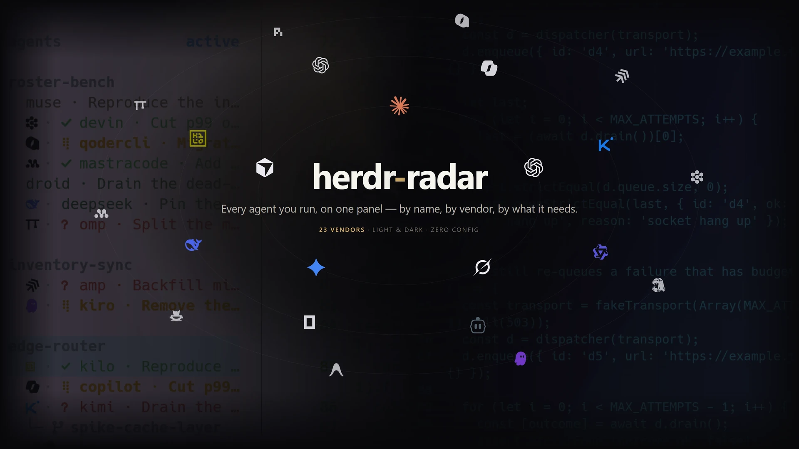
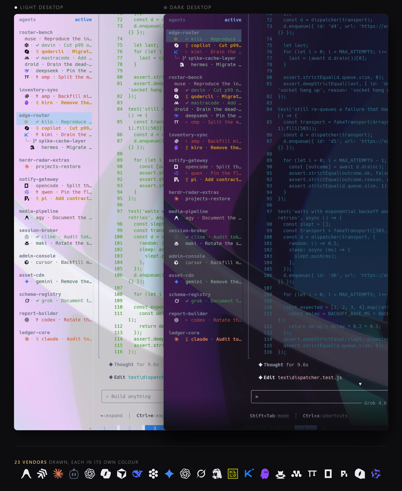

<div align="center">

# herdr-radar

**すべてのエージェントをひと目で**



<a href="https://github.com/hhdebb/herdr-radar/releases"></a>
<a href="https://nodejs.org"></a>
<a href="LICENSE"></a>

<a href="README.md">English</a> · <a href="README.zh-CN.md">简体中文</a> · <b>日本語</b>

</div>

---

## これは何か

[Herdr](https://herdr.dev) のプラグインです。サイドバーの Agents 一覧を、読めるパネルに変えます。
誰が作業中か、誰があなたの返事を待っているか、誰が 2 時間放置されているか——ひとつずつ開かなくても
わかります。インストールすれば動き、サイドバーに表示するトークンだけを書き、エージェント本体にも
ペイン名にも触れません。

## なぜ必要か

コーディングエージェントを十数個開いていると、Herdr 標準の Agents 一覧は役に立ちません。
どのセッションも同じ灰色の 1 行、`done` は数秒で `idle` に畳まれ、質問してきているものと先週の
火曜に放置したものが同じ見た目です。結局ひとつずつ切り替えて確かめることになります。

herdr-radar はその情報をサイドバーに載せます。完了したセッションはあなたが見るまでチェックを
残し、質問は答えるまでマークを残し、動きのないセッションは薄くなり、同じプロジェクトの
セッションは 1 つの見出しの下に集まり、いちばん忙しいプロジェクトが先頭に来ます。

## 得られるもの



- **状態が消えない。** チェックはペインにフォーカスするまで、クエスチョンマークはエージェントが
  再び動くまで残ります。idle は最後のターンからの経過時間で 3 段階に分かれ、放置された
  セッションは行ごと薄くなります。
- **一覧に構造がある。** ワークスペースごとの見出し、git worktree はリポジトリの下にツリーで、
  分割した画面のペインは隣り合って並び、いちばん忙しいプロジェクトが先頭、
  Spaces 列も同じ色で塗られます。
- **周辺も追従する。** タブバーに現在のディレクトリ、デスクトップのライト／ダークに合わせて
  Herdr のテーマが切り替わり、設定ポップアップひとつで全オプションを扱えます。

## クイックスタート

```sh
herdr plugin install hhdebb/herdr-radar
```

インストールはこれだけです。初回起動時にプラグインが残りを自分で済ませます。Herdr の
`config.toml` に 3 つの管理ブロックを書き（マーカーコメントで囲み、その外には触れない）、
アイコンフォントをユーザーのフォントディレクトリに入れ（管理者権限不要）、Ghostty / kitty の
設定があればコードポイントの割り当てを書き込みます。

> [!IMPORTANT]
> プラグインは Herdr サーバーが起動時に立ち上げます。インストール後にサイドバーが変わらなければ、
> デーモンを一度手で起動してください：
> `herdr plugin action invoke hhdebb.herdr-radar.state-start`。
> Herdr の再起動（`herdr server stop` の後に `herdr`）でも構いませんが、全ペインのプロセスが終了します。
> フォントは新しいターミナルウィンドウから読み込まれます。ターミナルによっては完全な再起動が必要です。

> [!NOTE]
> Herdr 0.9.0 以上、Node 18 以上が必要です。Windows 11 と macOS で確認済み、Linux は未確認です。
> コードポイント割り当てのないターミナル（Windows Terminal、iTerm）と、Windows でタブバーが `cd` に
> 追従しない件は「トラブルシューティング」を参照してください。

キーは 2 つ、任意です。`config.toml` に貼り付けます。どちらも Herdr のプレフィックス（既定は
`ctrl+b`）経由なので、ペイン内のプログラムと衝突しません。

```toml
[[keys.command]]
key = "prefix+a"
type = "plugin_action"
command = "hhdebb.herdr-radar.view-flip"       # 並び順：active <-> recent

[[keys.command]]
key = "prefix+comma"
type = "plugin_action"
command = "hhdebb.herdr-radar.settings"        # 設定ポップアップ
```

GitHub ではなくチェックアウトから入れる場合：

```sh
git clone https://github.com/hhdebb/herdr-radar.git
herdr plugin link ./herdr-radar
herdr plugin action invoke hhdebb.herdr-radar.state-start
```

`plugin link` はビルド手順を実行しません。同じセットアップはデーモンの初回起動が行うので、
3 行目が必要です。

### エージェントに任せる

次のひとかたまりをコーディングエージェントに貼れば、そのままインストールします:

```text
このマシンに Herdr のプラグイン herdr-radar をインストールしてください。

1. herdr plugin install hhdebb/herdr-radar
2. herdr plugin action invoke hhdebb.herdr-radar.state-start
3. 確認: `herdr plugin list` で hhdebb.herdr-radar が enabled になっていること、
   `herdr agent list` でエージェントが動いているペインに `sort_key` トークンが
   付いていること（これは状態によらず必ず書かれます。ロゴのトークン名は
   状態によって変わります）。

`herdr server stop` は実行しないでください。Herdr のプロセスも終了させないで
ください。すべてのペインのすべてのプログラムが終了します（あなたを動かして
いるものも含みます）。再起動が必要な手順はひとつもありません。プラグインは
初回起動時に自分で設定を書き、アイコンフォントは新しい端末ウィンドウが
自動的に読み込みます。

Herdr 0.9.0 以降と Node 18 以降が必要です。マークが四角で表示される場合は、
その端末にコードポイントマップがありません。この件を含め
https://github.com/hhdebb/herdr-radar の Troubleshooting を参照してください。
```

## サイドバーの見え方

```
dashboard
  ⣟ ✳ Implement OAuth scopes            ← working：点字スピナー、タイトルはベンダー色
  ✓ ✳ Wire retry budget into dispatcher ← done：緑のチェック、見るまで保持
  └─  feature/mc-13200                  ← リポジトリの下の worktree
    ? Λ Which env file should I edit?   ← blocked：脈打つ赤のマーク、質問中
billing
  ✳ Trace duplicate charges             ← idle：止まったばかり
  ✳ Migrate invoices table              ← idle が 2 時間以上：行ごと薄くなる
```

エージェントごとに 1 行。ロゴ、タイトル、状態に応じた色、タイトルの前に動きとマーク。並び順は
2 種類：`active` はグループを保ったまま両階層をアクティビティ順に、`recent` はフラットな
アクティビティ順。`prefix+a` で切り替えます。パネル全体を Herdr 本来の描画に戻す切り替えは
設定ポップアップにあります。

## 色の意味

1 行について一目で知りたいことは 2 つあり、それぞれ別々に担われています。**ロゴ**は誰の
エージェントかを、**タイトル**はそのエージェントが何をしているかを示します。どちらの読み取りも
もう一方に依存しません。

ロゴはそのベンダー自身の色をまといますが、まとうのはベンダーが**公開している**色だけです。
自らを黒や白で署名するブランドには借りられる色相がないので、そのマークは単にインクで
描かれます —— 明るいパネルでは黒、暗いパネルでは白 —— このプロジェクトが勝手に決めた色では
ありません。行の状態がどう変わっても、ロゴは変わりません。

タイトルは状態を担い、形もまた状態を担います。だから色が見えなくてもこのパネルは読めます：

| 状態 | タイトル | その前 |
| --- | --- | --- |
| 作業中 | ベンダーの色 | 点字スピナー、回転 |
| あなた待ち | 赤 | 疑問符、明滅 |
| 完了 | 緑 | チェック。ペインにフォーカスするまで残る |
| アイドル | 下記の鮮度スケール | リング |
| 不明 | 紫 | リング |

緑と赤は意味を持つ色であり、ブランドより優先されます。視線を引くために存在するので、どの
ベンダー色もこの 2 色にはなりません。作業中のタイトルが共通の「ビジー色」ではなくベンダーの
色相をまとうのは、30 行が並ぶ画面では、どの行の文字を読むより先に色相が「動いているセッション」
同士を見分けるからです。

**アイドルは状態ではなくグラデーションです。** エージェントが止まったあとに残る問いは
「どれくらい前に」だけなので、タイトルは最後のターンからの時間とともに冷えていきます。最初の
15 分は止まったばかりとして読め、その後 2 時間までは通常の文字色、それを過ぎると**行全体が
薄くなり** —— ロゴもマークも一緒に —— グループの底に沈みます。どちらのしきい値も設定項目です
（`activity_fresh_minutes`、`activity_stale_minutes`）。3 段階とも同じリングを描き、
どの段かは色だけが語ります。古くなるにつれて形が変わるマークは、3 回覚え直させることになるからです。

Spaces 列も同じベンダー色を使うので、どのワークスペースが Claude を、どれが Gemini を
動かしているかはそちらでも見分けられます。

## 対応するエージェント

24 のベンダーが独自のマークを持っています：

<!-- prettier-ignore -->
| | | | |
| --- | --- | --- | --- |
|  Amp |  Antigravity |  Claude Code |  Cline |
|  Codex |  Copilot |  Cursor |  DeepSeek |
|  Devin |  Gemini |  GLM |  GPT |
|  Grok |  Hermes |  Kilo |  Kimi |
|  Kiro |  Maki |  Mastra |  Oh My Pi |
|  OpenCode |  Pi |  Qoder |  Qwen |

Herdr はさらに 3 つ、Droid と Letta と Muse を検出しますが、いずれもこのプロジェクトが使える形で
マークを公開していません。それらの行も他と同じように動作し —— 状態も色も並び順もグループ化も
そのまま —— 独自のマークの代わりに汎用マークをまとうだけです。どちらかを追加するプルリクエストは
歓迎します。Antigravity と Kiro のマークもそうして届きました。

Herdr が認識してここに挙がっていないものも同じ扱いです：汎用マーク、独自の色、それ以外はすべて
そのまま。

### プロセス名がベンダーと一致しないとき

GLM のセッションは素の `claude` バイナリを Anthropic 互換エンドポイントに向けて実行するため、
Herdr は `claude` と検出します。これは正しく、これからも変わりません。既知のバイナリを包む
ラッパーはすべて同じです。検出はその先を見通せず、このプラグインも同じです。そのペインが何を
しているかは、起動した本人だけが知っています。

ならばラッパー自身に名乗らせます。Herdr には表示専用のフィールドがあり、`exec` の前に
1 行足すだけです:

```sh
herdr pane report-metadata "$HERDR_PANE_ID" --source user:cglm --display-agent glm
exec claude "$@"
```

その行は GLM のマークと名前をまといます。`--clear-display-agent` で元に戻ります。この
プラグインが認識しない値は行を空にせず無視されるので、`Claude: auth` のような人間向けの
ラベルでも Claude のマークはそのまま残ります。

## 設定

`prefix+,` で設定ポップアップを開きます。`↑↓` 選択、`←→` 変更、`↵` テキスト編集、`r` 既定値、
`s` 保存して適用、`q` 閉じる。保存は設定ファイルの変更行だけを書き換え、デーモンを再起動します。

| 項目 | 既定値 | 内容 |
| --- | --- | --- |
| `agents_panel` | `plugin` | このプラグインのパネル、または `herdr` で Herdr 本来のパネル |
| `order` | `active` | `active` グループ化してアクティビティ順 / `recent` フラット / `off` Herdr の順序 |
| `variant` | `auto` | ロゴをアイコンフォント（`font`）、通常の Unicode（`text`）、なし（`none`）。`auto` はプラグインが入れたフォントを認識 |
| `done_hold` | `until_seen` | チェックをフォーカスまで保持、または秒数 |
| `blocked_hold` | `true` | エージェントが再び動くまでクエスチョンマークを保持 |
| `idle_grace_seconds` | `2.5` | ターン終了とみなすまで idle が続く必要のある時間 |
| `activity_fresh_minutes` | `15` | 最後のターンからこの時間は fresh |
| `activity_stale_minutes` | `120` | この時間ターンがなければ行が薄くなる |
| `group_indent` | `2` | 見出しの下のメンバーの字下げ幅。`0` でフラット |
| `group_gap` | `true` | グループ間の空行 |
| `split_corner` | `false` | 分割画面の残りのペインを `├─` で最初のペインの下にぶら下げる |
| `row_label` | `title` | 行の名前：`title` セッションのタイトル、`tab` タブ名、`both` 両方（旧 `show_tab = true`） |
| `trim_group_prefix` | `true` | 見出しと同じ名前でタイトルが始まるとき、その部分を落とす |
| `worktree_mark` | `U+F418` | worktree 見出しのマーク（Nerd Font が必要）。空で非表示 |
| `follow_appearance` | `true` | デスクトップのライト／ダークに合わせて Herdr のテーマを切り替え |
| `colors.active_row_bg_light` | `#b9cdf2` | ライトテーマの選択行の背景。空ならテーマ自身の値 |
| `colors.active_row_bg_dark` | `#414868` | ダークテーマの選択行の背景 |

最初の 2 つはライブの状態です。残りは `$(herdr plugin config-dir hhdebb.herdr-radar)/config.toml`
にあり、手で編集してもかまいません。編集後は `state-stop`、続けて `state-start`。このファイルは
ポップアップが最初に保存したときに作られます。それより前に手で編集するなら、上の表のキーで自分で
作ってください（真偽値は引用符なし：`group_gap = false`）。

## トラブルシューティング

まず `herdr plugin log list --plugin hhdebb.herdr-radar --limit 20`。プラグインの各コマンドの出力と
エラーはそこにあります。

<details>
<summary><b>フォントを入れたのにロゴが四角やクエスチョンマークのまま</b></summary>

ターミナルがフォントを再読み込みしていません。新しいウィンドウを開くか、ターミナルを終了して
開き直してください。macOS はキャッシュがもう一段あります：`killall fontd fontworker` の後に開き直し。
</details>

<details>
<summary><b>ロゴがランダムな漢字で描かれる</b></summary>

別のフォントが同じ私用領域を主張しています（CJK フォントによくあります）。ターミナルは
`Herdr Agent Icons Max` にコードポイント単位で割り当てる必要があり、フォールバックに加えるだけでは
足りません。Ghostty / kitty：`herdr plugin action invoke hhdebb.herdr-radar.install-font` で書き込めます。
それ以外：`U+E1A0–U+E1B7` と `U+E1C0–U+E1C5` を手で割り当ててください。コードポイント割り当ての
ないターミナル（Windows Terminal、iTerm）は `dist/JetBrainsMonoHerdr-Regular.ttf` をターミナルの
フォントに——アイコンを埋め込んだ JetBrains Mono です。

Ghostty では割り当てが解決したかを答えられるのは `ghostty +show-face` だけで、
`+show-config` も `+list-fonts` もどちらでも通ります。v1.3.7 以前が書いた行は
ファミリー名を引用符で囲んでいて無効でした。インストールをもう一度実行してください。
</details>

<details>
<summary><b>インストールしても何も変わらない</b></summary>

デーモンが動いていません：`herdr plugin action invoke hhdebb.herdr-radar.state-start`。それでも
だめならプラグインのログでそのコマンドの出力を読んでください。よくある原因は、Herdr から
見える PATH に Node 18 以上がないこと、`config.toml` に管理ブロックを置く `[ui]` テーブルがないこと、
あるいは `[theme.custom]` / `[ui.sidebar.*]` テーブルを手で書いていることです。同じテーブルを 2 回
宣言するとファイル全体が壊れるので、プラグインは書き込みを拒否します。自分のものをどけるか、
そのままにして Herdr 本来のパネルを使ってください。
</details>

<details>
<summary><b>設定を変えたのに反映されない</b></summary>

デーモンは起動時に設定を読みます。設定ポップアップの `s` は再起動します。手で編集したあとは
`state-stop` の後に `state-start`。`config.toml` の 3 つの管理ブロックを直接編集しても、次の
`configure` で書き戻されます。
</details>

<details>
<summary><b>タブバーのパスが消えた、または 1 つのワークスペースでしか出ない</b></summary>

Herdr は幅を 1 列でも超えるとステータス領域を切り詰めずに丸ごと消します。環境変数
`HERDR_RADAR_TABBAR_MAX`（既定 48）を下げるか、サイドバーを狭くしてください。あるいは Herdr の
client と server のバージョンが違います（`herdr status` に `restart_needed: yes`）：
`herdr server stop` して開き直してください（全ペインのプロセスが終了します）。
</details>

<details>
<summary><b>Windows でタブバーがペイン起動時のディレクトリのまま</b></summary>

Windows の Herdr は `cd` を追えません。`~/.zshrc` または `~/.bashrc` から
`shell/herdr-osc7.zsh` / `.bash` を source してシェルに通知させてください。以後開いたペインに効きます。
</details>

<details>
<summary><b>設定ポップアップが一瞬で閉じる</b></summary>

Windows で `herdr plugin pane open` を手で実行するときは `--cwd <プラグインのディレクトリ>` が
必要です。ないと Herdr がペインに拡張長パスを渡し、Git Bash が入れません。割り当て済みの
`prefix+,` は渡しています。
</details>

<details>
<summary><b>エージェントが質問しているのにクエスチョンマークが出ない</b></summary>

プラグインは検出をせず、Herdr の判定を映すだけです。Herdr は画面上のダイアログの形で `blocked` を
判定し、認識できないものはすべて idle として扱います。`herdr agent explain <pane> --verbose` で
どのルールに一致したかが見えます。
</details>

## アンインストール

この順番で。`unconfigure` はデーモンを止め、書き込んだトークンをすべて消し、管理ブロックを
外します。プラグインが入っている間でないと呼び出せません。

```sh
herdr plugin action invoke hhdebb.herdr-radar.unconfigure
herdr plugin action invoke hhdebb.herdr-radar.uninstall-font
herdr plugin uninstall hhdebb.herdr-radar
```

残るのは設定のバックアップを含む状態ディレクトリ
`~/.local/state/herdr/plugins/hhdebb.herdr-radar`（Windows は `%LOCALAPPDATA%\herdr\plugins\...`）
だけです。何も残したくなければ手で削除してください。

## 仕組み

常駐デーモンが 1 つ。Herdr のイベントストリームで起こされ、フレームごとに `herdr agent list` から
スナップショットを取り、状態・グループ・ソートキーだけをサイドバーのトークンとして書きます。
ネットワークは使いません。Herdr の設定と自身の状態ディレクトリ以外で読むのは、セッション自身の
記録の末尾だけ——プラグインより古いペインに最終アクティビティ時刻を与えるためです。他の Herdr
プラグインと同じくあなたのユーザー権限で動き、Herdr はサンドボックス化しません。気になる場合は
導入前に `herdr-plugin.toml` と `bin/` を読んでください。

## ライセンスと謝辞

MIT。[LICENSE](LICENSE) を参照。[qintmb/herdr-icon-agent-ui](https://github.com/qintmb/herdr-icon-agent-ui)
からのフォークで、アイコンフォントと「1 コードポイント 1 ロゴ」の発想はそこから来ています。
フォント内のベンダーマークはそれぞれの所有者に帰属し、出典は
[THIRD_PARTY_NOTICES.md](THIRD_PARTY_NOTICES.md) に記載。`dist/JetBrainsMonoHerdr-Regular.ttf` は
SIL OFL 1.1 のもとで改変・改名した JetBrains Mono で、ライセンス全文は `dist/OFL.txt` として同梱しています。
